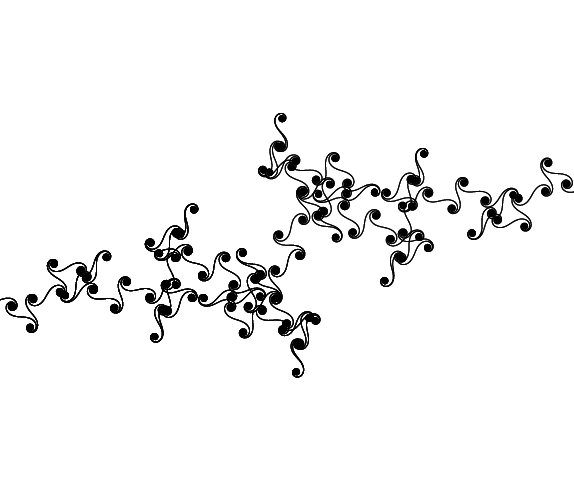
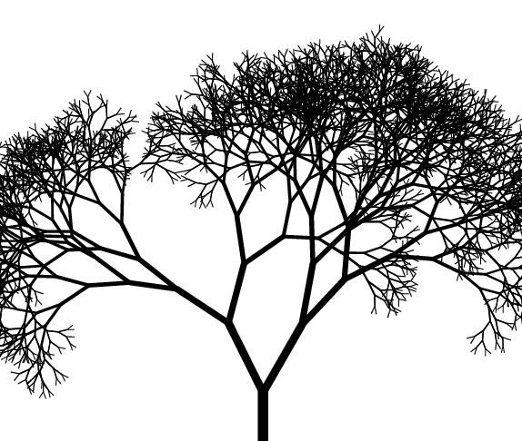

# Hobby-Projects
A list of (fun) projects I have made in my spare time outside of academia. These are mainly for practicing various aspects of coding and trying out different libraries; but these also work towards meshing my interests in Programming and Physics \\^o^/

<!---

  
<h3>Wordle-esque</h3>

  Text 1

--->

  
<h3>Strange Attractors (Chaos Theory)</h3>

  
  `search_attractors()`
  
  

  `draw_attractors()`
  

  
<h3>Euler Spirals</h3>

  
  This project visualised an Euler spiral, a mathematical curve where the curvature changes linearly with its length. Euler spirals are widely used in engineering, particularly in railway and road design, as they provide a smooth transition between straight and curved paths. This project used Python’s `turtle` library (Turtle graphics) to dynamically render the spiral by representing a physical "turtle" that draws the lines on a sheet of paper.

  - Implemented a recursive drawing function to generate the Euler curve based on incremental angle changes.
  - Used the `turtle` library to visualise the curve dynamically which enabled an intuitive representation of how the curvature evolves.
  - Adjusted tracer settings to optimise performance and ensure smooth rendering of the spiral for large numbers of iterations.
  - Experimented with different step sizes and angle increments to explore variations of the Euler spiral.

  

  
<h3>Fractal Trees</h3>

  
  In this project, I generated procedural fractal trees: a well-known example of self-similar patterns found in nature. By recursively splitting branches at varying angles and lengths, the code simulated the organic structure of trees. This technique is widely used in computer graphics, procedural generation, and mathematical visualisation. Python’s Turtle graphics provided an interactive and animated representation of these structures and showcased how simple rules can lead to complex and natural-looking forms.

  - Utilised a recursive function to create a branching structure where each segment splits into two smaller branches.
  - Introduced random noise to introduce variation in branch length and angles, and make the trees appear more 'natural'.
  - Varied pen width dynamically based on branch length to enhance the visual effect of depth.
  - Utilised Turtle's tracer settings to optimise rendering for large recursive depths and ensure a smoother animation.
  - Experimented with different branching angles, decay factors, and noise levels to explore a variety of fractal tree patterns.

  

